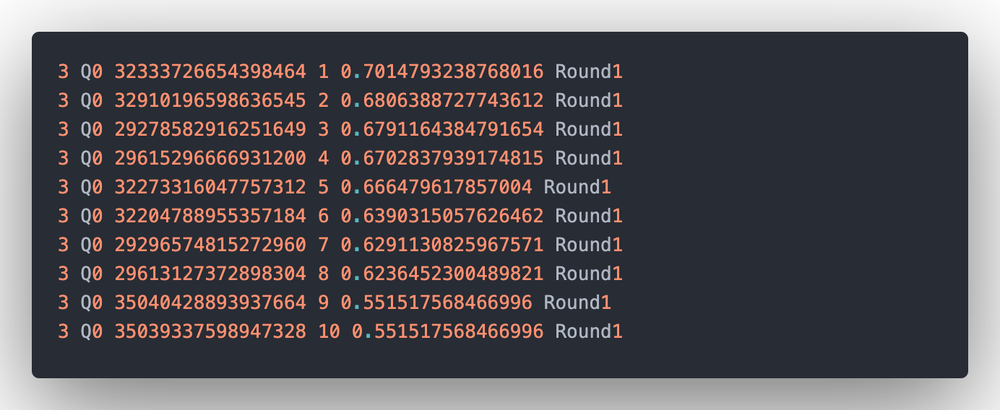
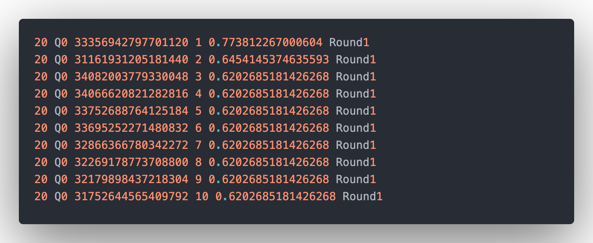
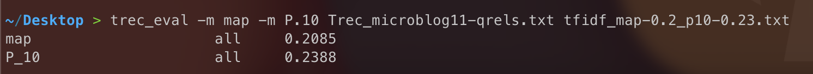
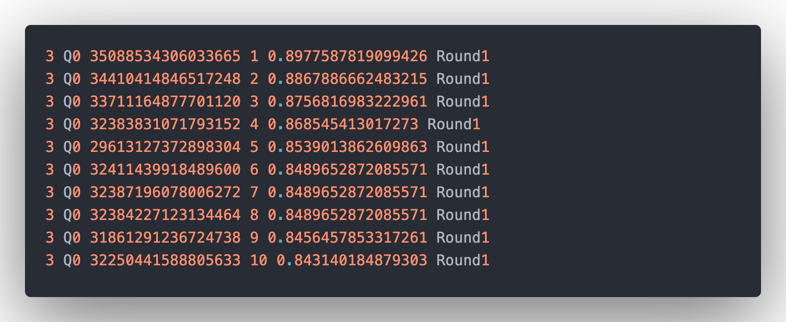
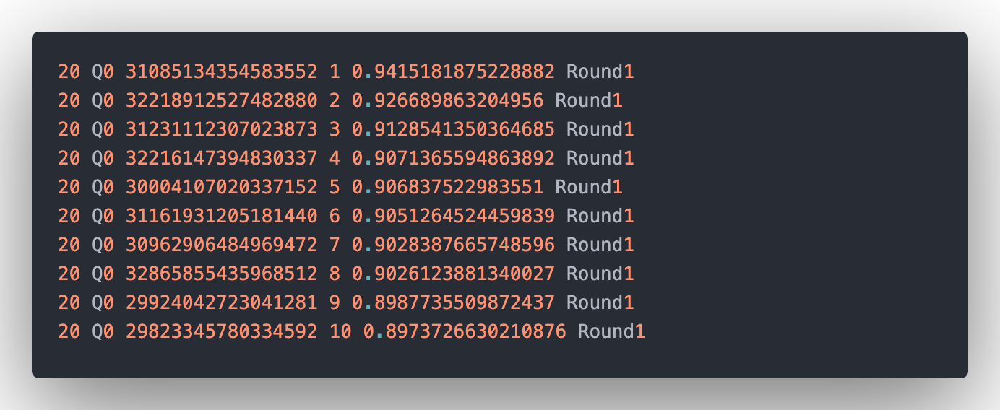
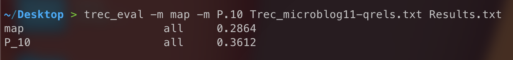
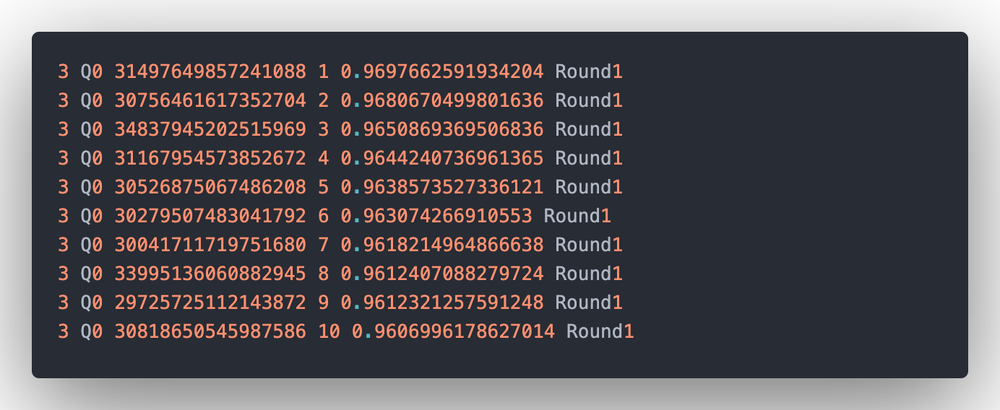
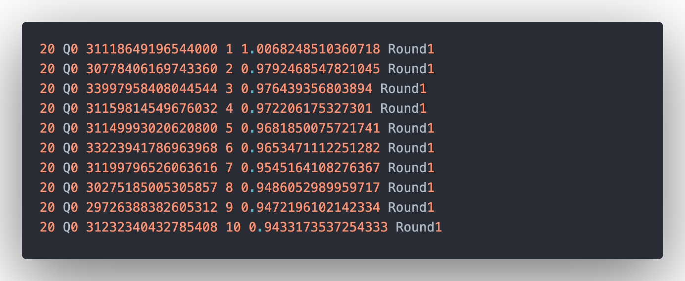
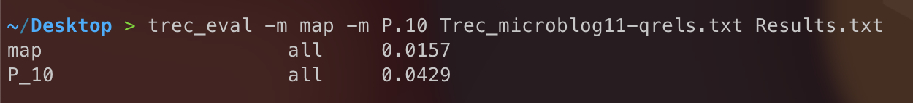

# CSI4107 Assignment 2
## Teamwork Distribution (marking scheme)
**Langqing Zou (300035036)**
1. Responsible for **TF-IDF Algorithm**
2. Responsible for **Doc2Vec Algorithm**
3. Responsible for **Writing final report**

I use doc2vec to ....... During the process, I found..... In the end, I got the results of ....

**Kangwei Liao (8568800)**
1. Responsible for **TF-IDF Algorithm**
2. Responsible for **Word2Vec Algorithm**
3. Responsible for **Code Transformation (from Java to Python)** 
4. Responsible for **Code Integration**

**Aozhuo Zhang (300057882)**
1. Responsible for **GloVe Algorithm**

## Steps To Run (Python 3.9 required)
_Using Pycharm is recommended, since many steps below can be automatically done for you_
1. Make sure the python version == 3.9
2. Install the python library [virtualenv] using command ```python3 -m pip install --user virtualenv```
3. Create a virtual environment in project directory using ```python3 -m venv env```
4. Activate the virtual environment using ```source env/bin/activate``` (Mac OS)
5. Install the packages specified in ```requirements.txt```
6. Run ```main.py``` using the **Python interpreter in virtual environment**

## The functionality of the programs
Firstly, the program deals with the collection which is the tweet messages by tokenizing and removing stop words. As for 
the tokenization, the program removes all the symbol in the collection. For example, "Latest::" will be "Latest". Also, 
the program scan the collection and remove words appeared in stopwords.txt.

Secondly, the program generated an inverted index based on the collection which is from above. The inverted index stores 
the terms and its document frequency and term frequency.

Thirdly, the program could retrieve queries and output the top 10 related Twitter comments by using the tf-idf algorithm, 
word2vec algorithm and doc2vec algorithm respectively for similar calculate.


## Algorithms and Data Structures
We used three methods to compute the similarity in this assignment. 
### TF-IDF
1. Stored the inverted index using dictionary.
2. For each query read from file, preprocess the query.
   - Remove stopwords, URLs, punctuations, spaces, numbers.
3. With the preprocessed queries, obtain tf-idf vectors for queries and store them in a directory.
4. Compute the cosine similarity between a query and all documents. Repeat until all queries' scores are computed.
5. Rank the results in decreasing order.

### Word2Vec (Gives the highest performance)
1. Stored the preprocessed documents using dictionary.
2. Train the word2vec model based on the preprocessed documents.
   - (vector_size=300, alpha=0.1, min_count=2, window=15, sg=1, epochs=45) gives known optimal model
   - With other conditions fixed, a higher
     - Alpha may result in a better performance, but after exceeded certain threshold will diverge (0.1 in our case).
     - number of epoch gives higher performance (diverge after epoch larger than 45 in our case).
     - window size will result in higher performance (higher than 15 results no significant improved in our case)
   - Trained on raw documents gives a lower performance.
   - Trained with skip-gram results in higher performance than CBOW.
3. For each query, preprocess it and obtain the top **n** synonyms of each word in the query.
   - Higher number of synonyms added to query may result in divergence (3 in our case).
   - Tried only add synonyms which cosine similarity with mean query vector larger than certain threshold (e.g. 0.5)
   will not result in a better performance.
4. Compare the mean vector for each query to all documents
   - Slightly improve the performance than not calculating the mean vectors
5. Rank the results in decreasing order.

### Doc2Vec
Doc2vec is an NLP tool for representing documents as a vector and is a generalizing of the word2vec method.
I used the *inverted-index vocabulary* retrieved from ```trec_microlog11.txt``` to train the Doc2vec model. 

One of the important part of this algorithm is **Paragraph vector**, which can be considered of as another word vector that plays 
the role of a memory. **Paragraph vector** can be considered as the main idea of the sentence and with it, the main idea 
of that sentence is put in as part of the input to be trained each time. In this way during each training, not only the 
words are trained but also the word vector is obtained. In order to have that, I modified the training data.

So in this algorithm, we stored training data in a list concludes *document id* and *terms in document*, which is type **TaggedDocument**. 
During training model, I focused on parameters: *window*, *vector_size*, *epochs* and *worker*. 
I tried different values of these four parameters. There are some values that make the results better and some that make them worse. 
For example, the result turned out that *vector_size = 100* is better than *vector_size = 200*. After the traning set prepared 
and model trained, I caculated the similarity between documents and each query. Then, I used ```Trec_microblog11-qrels.txt``` 
compared with ```results.txt```I got. MAP and P@10 are shown in the below section.


## First 10 answers to queries 3 and 20 (screenshots)
### TF-IDF Algorithm


**MAP and P@10**\


### Word2Vec Algorithm


**MAP and P@10**\


### Doc2Vec Algorithm


**MAP and P@10**\


### GloVe Algorithm

**MAP and P@10**\

## Discussion
The MAP and P@10 from **Doc2Vec** is not well so I search some resources online and have a conclusion. 
The *inverted-index vocabulary* we used is removing all stop-words, so number of terms in each document is small. 
Actually, the average number of terms in each document is around 8. 
That might be the reason why **Doc2Vec** performs worse than **Word2Vec**. 
Doc2Vec have better performance on documents with large number of terms.
